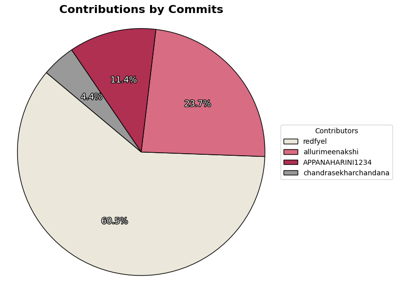

# Academia Connect: Bridging the gap between Students and Success

## Overview

Academia Connect is a comprehensive web application designed to enhance the student experience by providing a centralized platform for academic resources, progress tracking, and community engagement. 

## Tech Stack Deep Dive

Academia Connect is built using the MERN stack, a popular combination of technologies for creating dynamic and full-featured web applications.

**Front-End:**

* **React (with JSX):**  The core JavaScript library for building the user interface. React's component-based architecture promotes code reusability and efficient updates.
* **React Router:**  Handles client-side routing, allowing users to navigate smoothly between different views and features.
* **HTML, CSS, Bootstrap, Material-UI:** These technologies work together to create the visual presentation of the application. 
    * HTML provides the structural foundation.
    * CSS styles the elements for a visually appealing look.
    * Bootstrap and Material-UI offer pre-built components and design systems to accelerate development and ensure consistency.

**Back-End:**

* **Node.js:** The JavaScript runtime environment that powers the server-side of the application.
* **Express.js:** A minimalist web framework for Node.js, used to build RESTful APIs that handle data interactions between the front-end and the database.
* **MongoDB:** A NoSQL document database chosen for its flexibility and scalability in storing and managing user data, academic information, and other application data. 

## Key Features & Functionality

* **Exam Corner:**  Centralized exam schedules, deadlines, and study materials to help students stay organized. 
* **Attendance Tracker:**  Visualizations and tools for monitoring academic attendance.
* **Student Corner:** A dashboard providing access to community discussion, doubt solving and sharing grievances.
* **Event Calendar:**  Keeps students informed about upcoming academic events, workshops, and competitions.
* **User Profile:**  Personalized dashboard for displaying relevant information at one place.

## Future Enhancements

* **Integration with Learning Management Systems (LMS):**  Seamlessly connect with existing LMS platforms to provide a unified academic experience.
* **Collaboration Features:**  Facilitate student collaboration through features like group messaging, shared study spaces, and peer-to-peer learning tools.
* **Gamification and Rewards:**  Introduce gamification elements to motivate students and encourage engagement.

## Conclusion

Academia Connect represents a commitment to leveraging technology to empower students and enhance their academic journey. The application's intuitive design, comprehensive features, and robust technology stack make it an invaluable tool for students seeking to thrive in their academic pursuits. 

